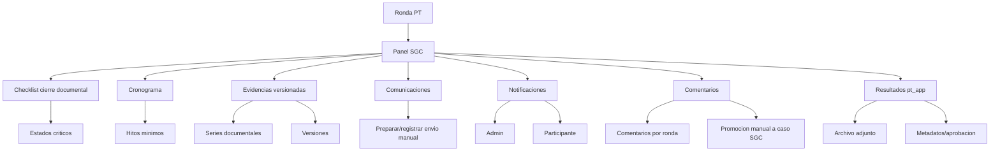
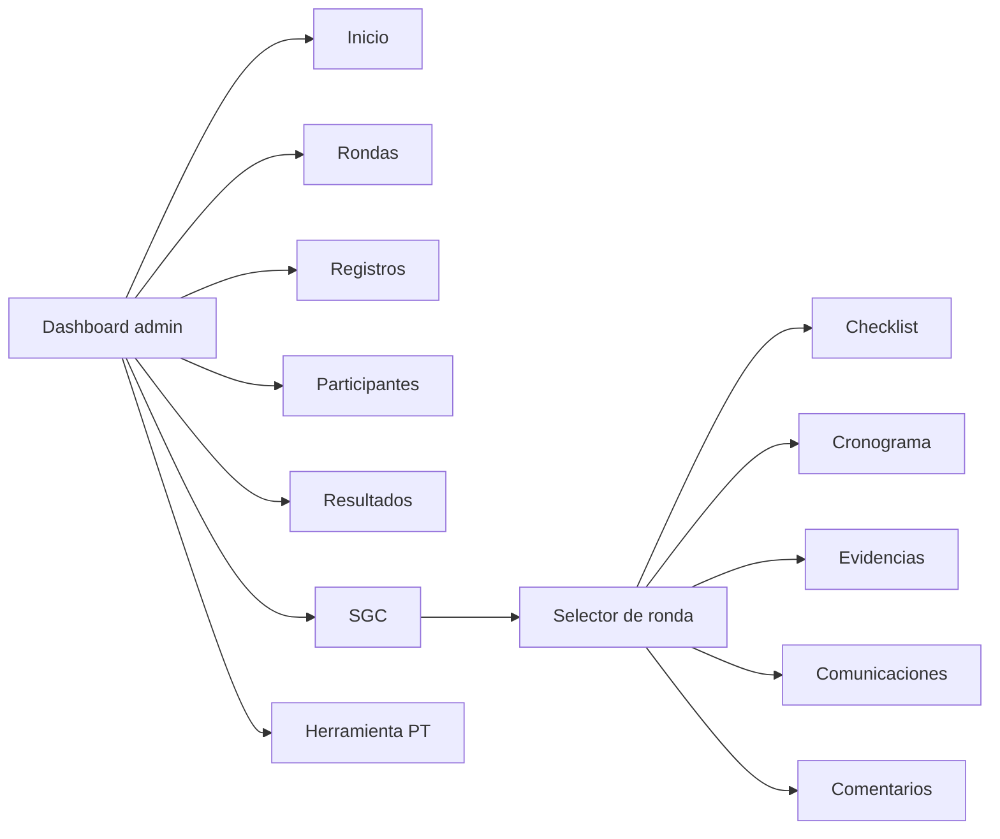
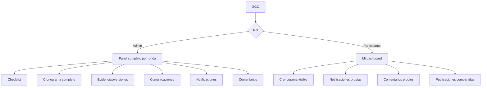
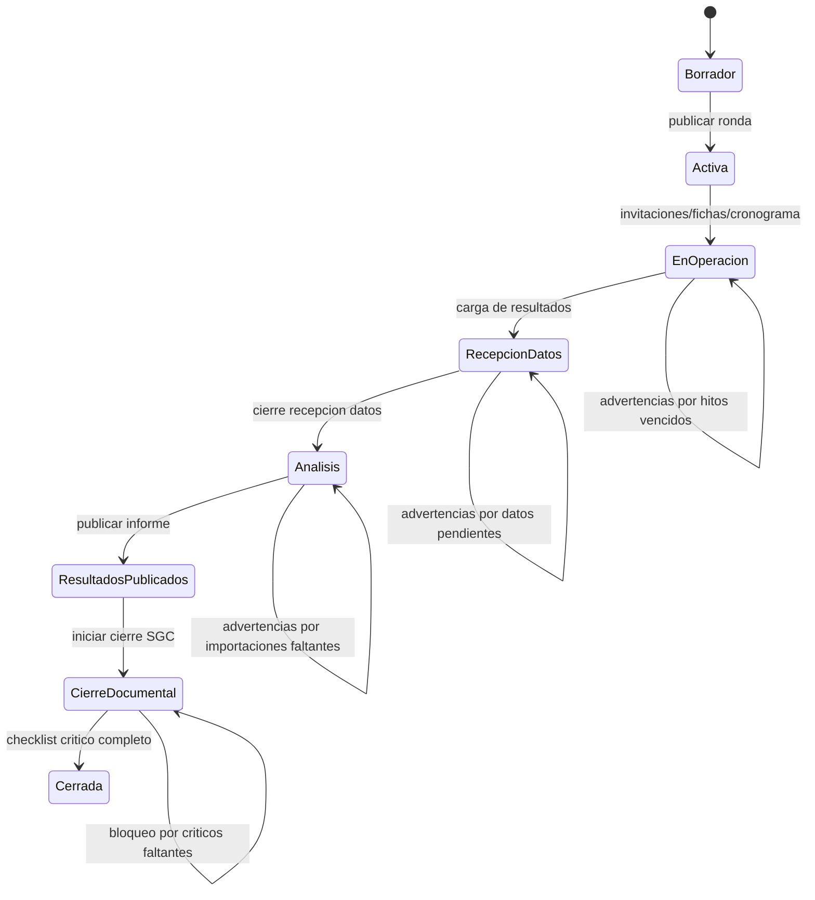
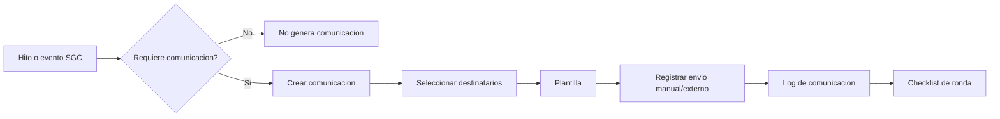
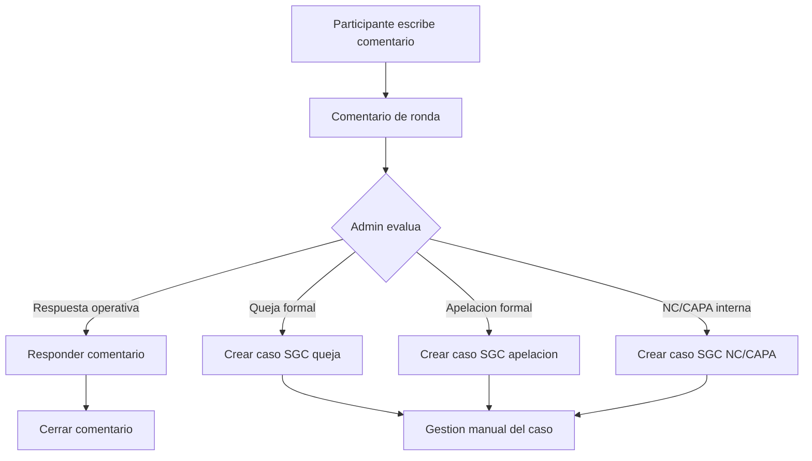
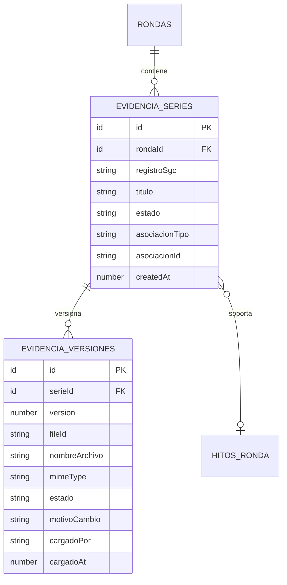
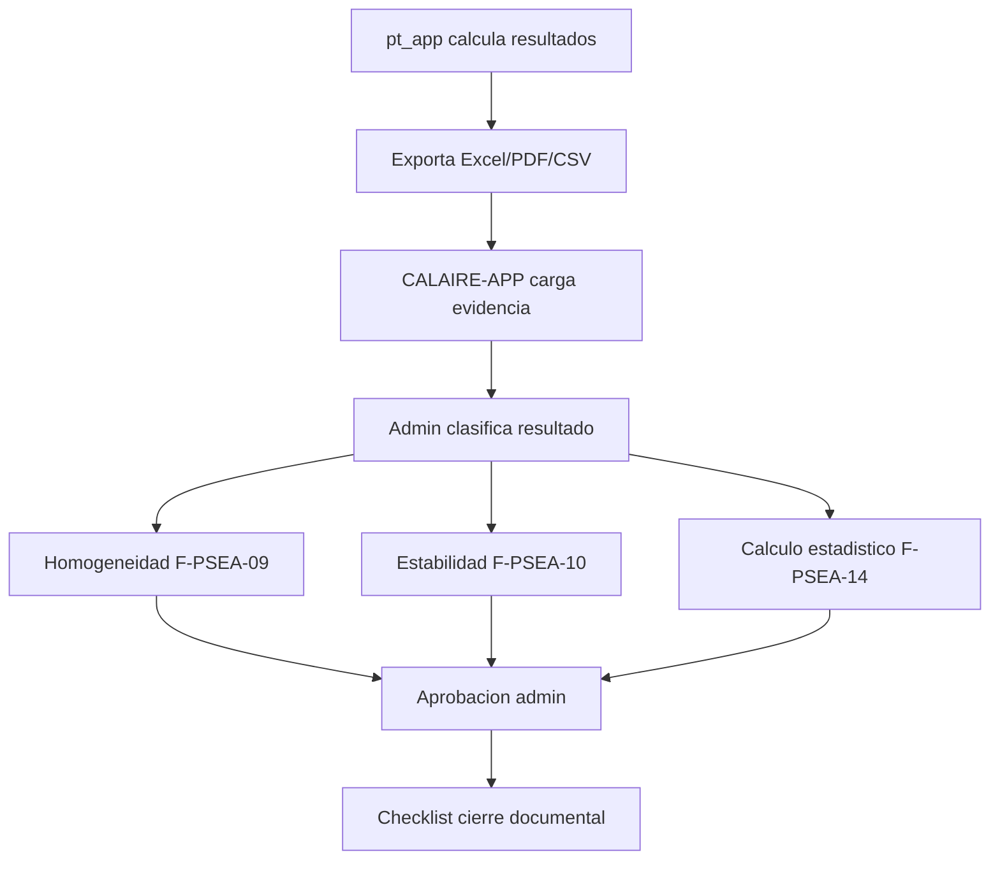

# Plan Codex: Panel SGC por Ronda

## Objetivo

Implementar una pestaña nueva **SGC** en CALAIRE-APP para centralizar el cierre documental del Sistema de Gestion de Calidad por ronda, sin convertir la app en un repositorio documental completo.

La app debe gestionar de forma nativa los registros vivos y trazables. Los documentos narrativos, procedimientos, instructivos, matrices e informes externos se mantienen como documentos controlados o evidencias adjuntas.

## Decisiones de diseno acordadas

| Tema | Decision |
|---|---|
| Naturaleza del panel | Panel operativo de cierre documental, no repositorio documental completo |
| Eje principal | Por ronda |
| Ubicacion | Pestaña nueva `SGC` en el dashboard admin |
| `Registros` | Se mantiene aparte |
| Funcionamiento | Checklist formal de cierre documental por ronda |
| Cronograma | Tabla nativa de hitos minimos |
| Hitos durante operacion | Advierten, no bloquean |
| Cierre documental | Puede bloquear si faltan registros criticos |
| Comunicaciones | Preparar y registrar comunicaciones manuales en MVP |
| Notificaciones | Visibles para admin y participantes segun audiencia |
| Evidencias | Versionamiento sencillo |
| Comentarios | Participante comenta por ronda |
| Quejas/apelaciones/NC | Admin registra manualmente cuando sean casos formales |
| Integracion `pt_app` | MVP adjunta archivo + metadatos/aprobacion |
| Visibilidad participante | Solo piezas que le corresponden en `Mi dashboard` |

## Regla nativo vs archivo

| Tipo | Criterio | Ejemplos |
|---|---|---|
| Nativo en app | Tiene estado, responsable, fechas, ronda, participante, trazabilidad, aprobacion o cierre | Cronograma, checklist, comentarios, comunicaciones, notificaciones |
| Archivo/evidencia | Politica, procedimiento, instructivo, matriz ocasional, informe narrativo o soporte externo | Manual, procedimientos, Excel formal, informe final |
| Mixto | La app ejecuta el flujo, pero conserva evidencia externa | Resultados `pt_app`, informe publicado, soporte de cambios |

## Arquitectura funcional

## Navegacion

## Visibilidad por rol

| Pieza | Admin | Participante |
|---|---:|---:|
| Checklist SGC | Si | No |
| Estados criticos de cierre | Si | No |
| Cronograma completo | Si | No |
| Cronograma que le toca | Si | Si |
| Evidencias internas | Si | No |
| Evidencias publicadas | Si | Si, si aplica |
| Comunicaciones registradas | Si | No completas |
| Notificaciones | Si | Solo propias |
| Comentarios | Todos | Solo propios |
| Versionamiento | Si | No, salvo documento publicado vigente |

## Cronograma nativo

El cronograma MVP es una tabla de hitos por ronda. No se implementa calendario ni Gantt inicialmente.

### Hitos minimos

| Orden | Hito | Obligatorio | Relacion SGC | Participante lo ve |
|---:|---|---|---|---:|
| 1 | Apertura de invitaciones | Si | P-PSEA-20 / F-PSEA-05 | No |
| 2 | Limite de confirmacion | Si | F-PSEA-05 | Si |
| 3 | Limite de ficha de registro | Si | F-PSEA-05A | Si |
| 4 | Preparacion de items | Si | F-PSEA-08 | No |
| 5 | Envio/entrega de instrucciones o items | Si | F-PSEA-11 | Si, si aplica |
| 6 | Inicio de mediciones | Si | P-PSEA-09 / I-PSEA-09 | Si |
| 7 | Cierre de recepcion de datos | Si | F-PSEA-12 | Si |
| 8 | Revision de datos | Si | F-PSEA-13 | No |
| 9 | Analisis estadistico | Si | F-PSEA-09/10/14 | No |
| 10 | Publicacion de resultados | Si | F-PSEA-04 / P-PSEA-20 | Si |
| 11 | Cierre documental de ronda | Si | Checklist SGC | No |

### Campos minimos por hito

| Campo | Tipo |
|---|---|
| `rondaId` | referencia a ronda |
| `tipoHito` | catalogo |
| `nombre` | texto editable |
| `fechaPlaneada` | fecha/hora |
| `fechaReal` | fecha/hora opcional |
| `responsable` | usuario/texto |
| `estado` | enum |
| `visibleParticipante` | booleano |
| `notas` | texto opcional |
| `requiereComunicacion` | booleano |
| `comunicacionEnviadaAt` | fecha opcional |
| `evidenciaAdjuntaId` | referencia opcional |
| `cambioCronograma` | booleano |
| `motivoCambio` | texto opcional |

## Estados de ronda y advertencias

## Registros criticos para cierre documental

Criticos siempre:

| Registro | Descripcion |
|---|---|
| F-PSEA-06 | Plan de ronda |
| Cronograma minimo | Hitos obligatorios |
| F-PSEA-07 | Lista maestra participantes |
| F-PSEA-05 / F-PSEA-05A | Confirmaciones y fichas aplicables |
| F-PSEA-08 | Preparacion de items |
| F-PSEA-11 | Envio/recepcion o entrega/instrucciones |
| F-PSEA-12 | Reportes de participantes |
| F-PSEA-13 | Revision de datos |
| F-PSEA-09/10/14 | Resultados estadisticos/importacion |
| Informe/publicacion | Evidencia de publicacion de resultados |

Criticos solo si existen casos:

| Registro | Condicion |
|---|---|
| F-PSEA-16 | Si hubo queja formal |
| F-PSEA-17 | Si hubo apelacion formal |
| F-PSEA-15 | Si hubo NC/CAPA |
| Cambios de cronograma | Si se modificaron hitos publicados |
| Evidencias externas | Si el checklist las requiere |

## Comunicaciones y notificaciones

MVP: la app prepara y registra comunicaciones para envio manual. No envia correos automaticamente.

| Evento | Canal recomendado | Registro SGC |
|---|---|---|
| Invitacion inicial | Correo/manual | Si |
| Confirmacion de cupo | In-app + evento automatico | Si |
| Ficha enviada | In-app | Si |
| Recordatorio de ficha pendiente | In-app primero; correo si vencida | Si |
| Cambio de cronograma | Correo/manual + in-app | Si |
| Recordatorio de cierre de datos | In-app primero; correo si critico | Si |
| Datos enviados | In-app | Si |
| Resultados disponibles | Correo/manual + in-app | Si |
| Queja/apelacion formal | Registro manual | Si |
| NC/CAPA interna | In-app admin | Si |

## Comentarios de ronda

Los participantes pueden crear comentarios asociados a una ronda. No son quejas formales por defecto.

## Evidencias con versionamiento sencillo

Cada evidencia pertenece a una serie documental. Cada carga crea una version. Solo una version queda vigente.

| Accion | Resultado |
|---|---|
| Primer archivo | Crea serie + version 1 vigente |
| Reemplazar archivo | Version anterior pasa a reemplazada; nueva version vigente |
| Retirar archivo | Version queda retirada con motivo |
| Cargar evidencia distinta | Nueva serie documental |
| Auditar | Historial completo visible para admin |

## Integracion con `pt_app`

MVP: CALAIRE-APP no reemplaza `pt_app`. Solo registra archivos exportados, metadatos y aprobacion.

Campos minimos:

| Campo | Tipo |
|---|---|
| `rondaId` | referencia |
| `tipoResultado` | `homogeneidad`, `estabilidad`, `estadistico` |
| `evidenciaSerieId` | referencia |
| `estado` | `pendiente`, `cargado`, `en_revision`, `aprobado`, `rechazado` |
| `aprobadoPor` | admin opcional |
| `aprobadoAt` | fecha opcional |
| `observaciones` | texto |
| `version` | numero |
| `origen` | `pt_app` |
| `fechaCalculo` | fecha opcional |

## MVP 1

Objetivo: cierre documental basico por ronda.

1. Agregar pestaña `SGC` al dashboard admin.
2. Crear selector de ronda para el panel SGC.
3. Crear checklist de cierre documental por ronda.
4. Crear cronograma nativo de hitos minimos.
5. Crear evidencias con versionamiento sencillo.
6. Crear comunicaciones manuales registradas.
7. Crear notificaciones admin/participante.
8. Crear comentarios de ronda.
9. Mostrar al participante solo cronograma visible, notificaciones propias, comentarios propios y publicaciones compartidas.
10. Implementar advertencias por hitos vencidos y faltantes.
11. Bloquear solo el cierre documental si faltan criticos.

## MVP 2

1. Preparacion de items como formulario nativo (`F-PSEA-08`).
2. Envio/recepcion o entrega/instrucciones nativo (`F-PSEA-11`).
3. Revision de datos nativa (`F-PSEA-13`).
4. Casos SGC formales:
   - quejas (`F-PSEA-16`)
   - apelaciones (`F-PSEA-17`)
   - NC/CAPA (`F-PSEA-15`)
5. Importacion estructurada desde `pt_app`.
6. Vista Gantt/calendario si la tabla de hitos resulta insuficiente.
7. Automatizacion de correos/recordatorios si se requiere.

## Tablas Convex propuestas para MVP 1

Nombres tentativos:

| Tabla | Proposito |
|---|---|
| `sgcChecklistItems` | Estados de cierre documental por ronda |
| `sgcHitosRonda` | Cronograma nativo |
| `sgcEvidenciaSeries` | Serie documental por ronda/registro |
| `sgcEvidenciaVersiones` | Versiones de archivos |
| `sgcComunicaciones` | Comunicaciones preparadas/registradas |
| `sgcNotificaciones` | Notificaciones in-app |
| `sgcComentariosRonda` | Comentarios de participantes por ronda |
| `sgcRespuestasComentario` | Respuestas a comentarios |
| `sgcResultadosExternos` | Metadatos/aprobacion de resultados `pt_app` |

## Orden tecnico recomendado

1. Schema Convex e indices.
2. Funciones Convex para listar/crear/actualizar por `rondaId`.
3. Pestaña `SGC` en dashboard admin.
4. Vista admin con selector de ronda y secciones.
5. Cronograma + checklist.
6. Evidencias/versiones.
7. Comunicaciones/notificaciones.
8. Comentarios de ronda.
9. Piezas visibles para participante en `Mi dashboard`.
10. Validaciones de cierre documental.

