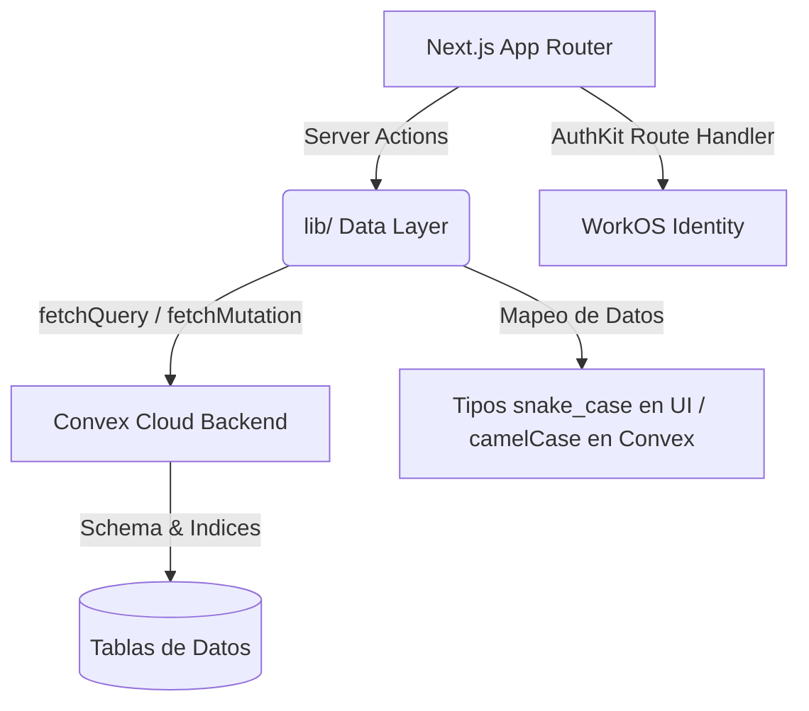

# Reporte Consolidado de Avances y Estado del Proyecto: calaire-app

**Fecha de Emisión**: 9 de junio de 2026  
**Periodo Cubierto**: 21 de abril de 2026 → 9 de junio de 2026  
**Aplicativo**: Portal de Gestión de Ensayos de Aptitud CALAIRE-EA  
**Repositorio**: `/home/w182/w421/calaire-app`  
**Base de Datos**: Convex Backend (steady-kiwi-725)  
**Despliegue**: Vercel Production (`https://calaire-app.vercel.app`)  

---

> [!NOTE]
> Este documento consolida la reconstrucción cronológica y el estado de madurez operativa del aplicativo `calaire-app`, detallando los hitos diarios, decisiones de arquitectura técnica y la lista de tareas pendientes (Backlog) para el cierre técnico y documental.

---

## 1. Evolución Cronológica y Hitos Diarios

### Día 1 — 2026-04-21: Construcción de Cimientos y Flujos Base
* **Configuración del Stack Inicial**: Configuración del proyecto base con Next.js 16 (App Router), autenticación mediante WorkOS y base de datos relacional inicial en Supabase.
* **Modelo de Datos Relacional**: Creación de la estructura de tablas inicial (`rondas`, `ronda_contaminantes`, `ronda_participantes`, `envios`).
* **Sistema de Diseño "Institutional Gold"**: Creación de variables CSS en `globals.css` importando la paleta dorada `#FDB913` (de `pt_app`). Definición de componentes puros (`.card`, `.btn-primary`, `.numeric`, `.card-accent`).
* **Integración Visual**: Logo de la Universidad Nacional de Colombia (UNAL) integrado usando `next/image` con priorización LCP.
* **Mecanismo de Invitación por Tokens**: Implementación de modelo de cupos en `ronda_participantes` con tokens manuales (`pendiente:<token>`) para vinculación automática de cuentas en el primer inicio de sesión.
* **Dashboard del Coordinador**: Flujo para creación y edición de rondas (estados: `borrador → activa → cerrada`), administración de contaminantes por ronda, buscador de usuarios y asignación de participantes.
* **Cierre Formal del Participante**: Creación de Server Actions (`enviarInformeFinalAction()`) para congelar datos mediante la marca temporal `submitted_at`.

### Día 2 — 2026-04-22: Flujos Avanzados de Autenticación y Referencia
* **Configuración del Administrador PT**: Completación de la Fase 1b administrativa para gestión de ensayos de aptitud (PT).
* **Definición de Contratos CSV**: Planificación de la exportación compatible con R en `pt_app` (formato `summary_n13.csv`).
* **Acceso Directo PT App**: Integración visual de tarjeta de enlace en el panel del coordinador para redirigir a la URL Shiny del análisis estadístico.
* **Autenticación Magic Link / OTP**: Habilitación en WorkOS de inicio de sesión sin contraseñas por correo electrónico (Magic Auth), eliminando restricciones de coincidencia de roles.
* **Formulario de Laboratorio de Referencia**: Componente `FormularioReferencia.tsx` con distintivos visuales (badge violeta) condicionado a perfiles `member_special` en la base de datos.

### Día 3 — 2026-04-23: Digitalización de la Ficha de Registro F-PSEA-05A
* **Ficha de Registro Completa**: Creación de 4 tablas relacionales (`fichas_registro`, acompañantes, analizadores, instrumentos) con RLS y triggers de actualización.
* **Mecanismo de Auto-guardado Activo**: Integración de llamadas AJAX al evento `onBlur` de componentes para persistencia instantánea y colecciones dinámicas reactivas con confirmaciones de guardado.
* **Estructura Metrológica Ampliada**: Migración de la tabla de envíos (`envios_pt`) en Supabase para incluir columnas numéricas `d1`, `d2`, `d3`, `ux` y `ux_exp`, resolviendo bloqueos de ejecuciones parciales previas.

### Día 4 — 2026-04-24: Despliegue Vercel y Límites Arquitectónicos
* **Puesta en Producción Inicial**: Despliegue en la URL oficial de Vercel administrando variables y configuraciones de callback de AuthKit WorkOS en producción desde CLI.
* **Decisión de Arquitectura Clave**: Se determinó que el procesamiento pesado de datos crudos (limpieza de ruido, agregación horaria, cálculo de incertidumbre estadística y medias móviles) se ejecutará **offline en R** (`pt_app` y `ptcalc`), dejando a `calaire-app` como un portal transaccional ligero de carga y gestión.

### Día 5 — 2026-04-26: Migración Supabase → Convex (Esquema y Funciones)
* **Fase 2 (Schema Convex)**: Creación de `convex/schema.ts` (11 tablas y 24 índices). Mapeo de UUIDs a tipos `Id<"tabla">`, marcas Unix en milisegundos (`v.number()`), arrays y validaciones tipadas.
* **Fase 3 (Backend Convex)**: Escritura de mutaciones y queries transaccionales en `convex/rondas.ts`, `convex/fichas.ts` y `convex/pt.ts`, implementando lógica de queries encadenadas (evitando JOINs) y cascadas de eliminación manuales.
* **Fase 4 (Capa de Acceso)**: Reescritura total de `lib/rondas.ts` y `lib/fichas.ts` usando `fetchQuery` y `fetchMutation` de Convex, aislando las llamadas backend camelCase sin modificar la firma original de las Server Actions snake_case.

### Día 6 — 2026-04-27: Cierre de Migración y Mejoras de UX Coordinador
* **Fase 5 (Herramienta Migratoria)**: Desarrollo del script `scripts/migrate-supabase-to-convex.mjs` con banderas `--dry-run` y `--wipe` para transferir datos históricos mapeando referencias en memoria.
* **Fase 6 (Desconexión Supabase)**: Limpieza completa de bibliotecas y variables Supabase, migrando 100% de la lógica a Convex en producción.
* **Bandeja de KPIs Administrativa (Fase 2)**:
  * Inserción del componente `KpiBar` alimentado por consultas optimizadas en paralelo para evitar latencias en el dashboard.
  * Unificación de fila de acciones en la tabla de rondas (`RowActionLink`).
  * Restauración de botones e inputs para transiciones de ciclo de vida de rondas (`borrador → activa → cerrada → reabierta`).

### Día 7 — 2026-04-28: Rediseño Masivo de PT y Flujo del Participante
* **Configuración PT Avanzada**: Sustitución de textarea de niveles por `PTLevelsBulkForm.tsx` (grilla editable e interactiva con inserción dinámica de 1 o 5 filas en cliente).
* **Flexibilización de Fichas**: Desbloqueo del acceso a la Ficha de Registro para participantes asignados a rondas que aún se encuentran en estado de borrador.
* **Header de Navegación del Participante**: Inclusión de barra de control en `/ronda/[codigo]/registro` para facilitar el retorno al dashboard, cierre de sesión y redirección a carga de datos cuando aplique.

### Día 8 — 2026-04-29: Unificación Visual del Dashboard
* **Estandarización de Layouts**: Uso del ancho máximo `max-w-7xl` para páginas de tablas/métricas y `max-w-3xl` para simplificar la lectura de formularios anchos.
* **Rediseño de Navegación Contextual**: Reemplazo de barra plana de pestañas por la tarjeta unificada de navegación de ronda (`RondaContextNav`) que incluye breadcrumbs contextuales.
* **Orden de Pestañas**: Secuencia basada en el ciclo de trabajo: *Resumen → Configuración PT → Participantes → Resultados*.
* **Tarjeta de Métrica Homologada**: Adopción de la clase `.card-accent` con borde dorado izquierdo y tipografía de tamaño destacado.

### Día 9 — 2026-04-30: Sistema de Identificadores Anónimos y Compilación Offline
* **Códigos Aleatorios Únicos**: Generación automática de `participantCode` de 6 caracteres con alfabeto restringido para evitar confusión visual (`ABCDEFGHJKLMNPQRSTUVWXYZ23456789`).
* **Inserción Secuencial**: Conexión del generador en procesos de alta (`assignParticipante`, `addReferenceSlot`, `createConfiguredRonda`) de forma transaccional.
* **Backfill de Códigos**: Creación de la mutación de utilidad `backfillParticipantCodes` para asignar de manera retroactiva códigos a participantes antiguos sin alterar tokens ni datos previos.
* **Protección de Exportación**: Bloqueo con código de error `409` en la descarga de reportes CSV si existen registros de envíos finalizados con códigos vacíos o inconsistentes.
* **Compilación en Sandbox**: Reemplazo del importador de fuentes remoto por pilas locales para evadir restricciones de red y adición offline de dependencias bloqueantes (`@workos-inc/node`).

### Día 10 — 2026-05-19: Factor 'k' y Campo Manual de Incertidumbre
* **Corrección Metrológica**: Modificación del flujo de incertidumbre. Se determinó que la Incertidumbre Expandida `u(x) exp` es de entrada manual y no se auto-calcula con `u(x) * k`.
* **Factor de Cobertura `k` Completo**: Adición en esquema de base de datos de la columna opcional `k` a nivel de `enviosPt`. Habilitación de inputs para `k individual` y `k grupal` tanto en `FormularioRonda` (participantes ordinarios) como en `FormularioReferencia` (laboratorio de referencia).
* **Navegación e Integración CSV**: Inclusión del factor `k` en contratos de importación y exportación de archivos CSV PT.

### Día 11 — 2026-05-20: Edición Administrativa Absoluta (Bypassing)
* **Bypass de Bloqueos por Estado**: Desarrollo de mutaciones y Server Actions administrativas dedicadas para permitir la edición forzada de fichas de registro y datos PT desde el rol coordinador, independientemente de si la ficha ya fue enviada o si la ronda está cerrada.
* **Editor de Datos Administrativo**: Creación del sub-dashboard `/dashboard/rondas/[id]/participantes/[pid]/datos` para que el coordinador corrija mediciones cargadas.
* **Desbloqueo de Gestión de Usuarios**: Eliminación de la redirección forzada a Configuración PT que impedía agregar o modificar participantes cuando no se habían declarado niveles de ensayo en la ronda.

### Día 12 — 2026-05-21: Panel de Resultados y Guía del Participante
* **Bandeja Avanzada de Resultados**: Pestaña unificada de Resultados globales con desglose interactivo y tablas de navegación.
* **Edición Avanzada de Estructura de Ronda**: Sustitución del formulario simple de edición por una UI robusta que permite reconfigurar contaminantes, niveles y réplicas en rondas activas sin envíos confirmados.
* **Redacción de la Guía del Participante**: Creación de `guia-ppt-agy-cld.md` (31 KB), derivando instrucciones de navegación y carga basadas estrictamente en la interfaz de la aplicación, omitiendo deliberadamente procesos y reglas de base de datos internas.

### Día 13 — 2026-05-22: Publicación y Despliegue de la Guía del Participante
* **Guía Interactiva en Producción**: Integración de la guía del participante con mockups visuales incrustados, enlaces de navegación directa y despliegue del HTML estático en `/guia.html`.
* **Ocultamiento de Niveles PT**: Modificación de los formularios de carga de datos del participante para ocultar los niveles de concentración PT, garantizando la confidencialidad durante el llenado de datos.

### Día 14 — 2026-06-03: Optimización del Flujo del Participante, Correos y Indexación
* **Indexación de Correos Electrónicos**: Actualización del esquema en Convex para asociar directamente el correo del participante en `rondaParticipantes` y creación del índice `by_email` para acelerar búsquedas y verificaciones.
* **Migración de Datos Históricos**: Adaptación del esquema para admitir y procesar de manera segura registros previos de fichas sin pérdida de datos.
* **Mejoras UX del Dashboard del Participante**: Simplificación del estado vacío para participantes que no tienen rondas asignadas. Ocultamiento de bloques de KPI innecesarios y adición de botón para el cierre de sesión directo en la cabecera.
* **Script de Lanzamiento**: Inclusión de scripts automatizados para el control de releases y despliegues del aplicativo.

### Día 15 — 2026-06-04: Robustecimiento del Mecanismo de Reutilización de Fichas
* **Exclusión de Ficha Activa**: Ajuste en la lógica de auto-llenado de la Ficha de Registro para excluir explícitamente el documento actual, previniendo referencias circulares u escrituras erróneas.
* **Seguridad en la Restauración**: Limitación de la reutilización de datos de participación a los registros vinculados estrictamente al correo electrónico del participante actual.

### Día 16 — 2026-06-08: Seguridad, Trazabilidad y Autenticación del SGC
* **Motor del SGC**: Creación del catálogo de los 12 formatos del Sistema de Gestión de Calidad (SGC) en `lib/sgc/catalog.ts` y desarrollo del validador dinámico de cumplimiento en `lib/sgc/checklist.ts`.
* **Puente de Autenticación WorkOS + Convex**: Habilitación del validador JWT de WorkOS en Convex (`convex/auth.config.ts`), securizando todas las mutaciones y consultas del SGC bajo roles de coordinador.
* **Registro de Auditoría (Audit Log)**: Implementación de la tabla `sgcAuditLog` en base de datos para almacenar pistas de auditoría inmutables de las acciones de los coordinadores.
* **Plantillas de Comunicación (P-PSEA-20)**: Creación de plantillas predefinidas en `/public/sgc/templates/p20/` para notificaciones estandarizadas del sistema (convocatoria, recordatorios de fechas límites, cierres y resultados).

### Día 17 — 2026-06-09: Implementación y Validación del Expediente SGC y Plan de Ronda
* **Expediente de Calidad Interactivo**: Creación del componente principal `ExpedienteSgc.tsx` y su lógica de servidor en `/dashboard/rondas/[id]/sgc/` para que los coordinadores visualicen el estado de los 12 documentos de la ronda (Nativos, Calculados y de Archivo).
* **Gestión de Evidencias y Excepciones**: Habilitación del flujo de carga de evidencias físicas (PDF) directo al Storage de Convex, y el flujo de justificaciones escritas obligatorias para omitir desvíos en documentos calculados.
* **Plan de Ronda Completo (F-PPSEA-03)**: Integración en la UI del editor estructurado de bloques `a-u` para definir y guardar la planificación metrológica de la ronda, junto con su layout de impresión CSS.
* **Cierre y QA de Fase MVP**: Validación y pruebas de extremo a extremo en producción del Expediente SGC, y reubicación de la documentación interna a la carpeta estructurada `_workspace/` para organizar el repositorio.

---

## 2. Decisiones Clave de Arquitectura Técnica



1. **Aislamiento de la Capa de Datos (Data Access Layer)**: A pesar de la migración profunda de Supabase a Convex, la interfaz y las Server Actions de la carpeta `app/` no requirieron cambios de firmas. Las funciones en `lib/rondas.ts` y `lib/fichas.ts` actúan como traductores de tipos.
2. **Cierre Transaccional Dinámico**: No se utiliza una tabla separada para el envío de informes; la presencia de la marca Unix ms en `submittedAt` actúa de forma nativa para bloquear la edición y determinar el estado de completitud.
3. **Roles Dinámicos Vinculados a la Ronda**: El perfil del usuario (`participant_profile`) se evalúa de manera contextual por ronda (`ronda_participantes`), permitiendo que un mismo usuario actúe como laboratorio ordinario (`member`) en una ronda y como laboratorio de referencia (`member_special`) en otra.
4. **Sistema de Gestión de Calidad (SGC) Digitalizado**: En lugar de depender de carpetas compartidas o archivos estáticos locales, se desarrolló un motor integrado que evalúa de forma activa el cumplimiento de los 12 formatos clave del SGC por cada ronda de ensayos.
5. **Trazabilidad Inmutable e Historial (Snapshots)**: Para cumplir rigurosamente con los requisitos de la norma ISO/IEC 17043, se implementó el almacenamiento de evidencias en Storage, el registro de justificaciones escritas y la tabla `sgcRegistroSnapshots` para congelar digitalmente la configuración metrológica de los planes de ronda y de la revisión de datos.

---

## 3. Estado de la Base de Datos (Convex Cloud)

Las siguientes colecciones estructuradas operan en el backend de Convex de forma robusta con sus respectivos índices compuestos y ordenamiento:

| Tabla Convex | Índice Compuesto Crítico | Función Operativa |
|---|---|---|
| `rondas` | `by_codigo` | Almacena configuraciones globales de rondas de ensayo. |
| `rondaContaminantes` | `by_ronda` | Desglose de contaminantes vinculados a cada ronda. |
| `rondaParticipantes` | `by_ronda_user`, `by_token`, `by_email` | Cupos de participación, perfiles, códigos de invitación y correo electrónico indexado. |
| `rondaPtItems` | `by_ronda` | Configuración de corridas y contaminantes de la ronda. |
| `rondaPtSampleGroups` | `by_ronda` | Grupos de muestra para ensayos complejos. |
| `envios` | `by_ronda_user_cont_nivel` | Mediciones cargadas por participantes normales. |
| `enviosPt` | `by_participante_item_group` | Mediciones cargadas bajo el esquema PT e Incertidumbre. |
| `fichasRegistro` | `by_ronda_participante` | Respuestas escalares de la Ficha F-PSEA-05A. |
| `fichasRegistroAcompanantes` | `by_ficha` | Lista dinámica de personal acompañante del laboratorio. |
| `fichasRegistroAnalizadores` | `by_ficha` | Lista dinámica de analizadores del laboratorio. |
| `fichasRegistroInstrumentos`| `by_ficha` | Lista dinámica de instrumental auxiliar declarado. |
| `sgcPlanRonda` | `by_rondaId` | Almacena las secciones y bloques a-u de metrología y planificación de rondas (F-PPSEA-03). |
| `sgcRevisionDatos` | `by_rondaId` | Evaluaciones y listas de chequeo pre-análisis de los datos reportados (F-PSEA-13). |
| `sgcRevisionHomogeneidad`| `by_rondaId` | Registro de controles de homogeneidad y estabilidad de muestras (F-PSEA-09/F-PSEA-10). |
| `sgcHitosRonda` | `by_rondaId`, `by_rondaId_and_estado` | Cronograma e hitos clave del ciclo de vida de la ronda. |
| `sgcJustificaciones` | `by_rondaId`, `by_rondaId_and_formato_and_estado` | Justificaciones escritas de excepciones y desvíos documentales del SGC. |
| `sgcEvidenciaSeries` | `by_rondaId`, `by_rondaId_and_formato` | Series de archivos y evidencias físicas subidas para los formatos del SGC. |
| `sgcEvidenciaVersiones`| `by_rondaId`, `by_serieId_and_estado` | Control de versiones y metadatos de los archivos cargados en el Storage de Convex. |
| `sgcRegistroSnapshots` | `by_rondaId_and_tipoRegistro` | Capturas inmutables históricas del plan de ronda y revisión de datos. |
| `sgcAuditLog` | `by_rondaId` | Trazabilidad detallada de acciones administrativas por actor. |
| `sgcComunicaciones` | `by_rondaId_and_tipo` | Historial de comunicaciones emitidas (correo, llamadas, reuniones) asociadas a la ronda (P-PSEA-20). |
| `sgcPublicaciones` | `by_rondaId_and_visible` | Comunicados oficiales y resultados publicados accesibles por los participantes. |
| `sgcComentariosRonda` | `by_rondaId_and_estado`, `by_rondaParticipanteId` | Retroalimentaciones y soporte interactivo entre participantes y coordinación. |
| `sgcNotificaciones` | `by_rondaId`, `by_destinatarioEmail` | Mensajes automatizados de recordatorio, cronograma y resultados del sistema. |
| `sgcResultadosPtApp` | `by_rondaId_and_tipoResultado` | Resultados y evaluaciones estadísticas calculadas externamente en pt_app. |
| `sgcCasos` | `by_rondaId_and_estado` | Registro unificado de No Conformidades (NC/CAPA), quejas y apelaciones (F-PSEA-15, F-PSEA-16, F-PSEA-17). |
| `documentosSgc` | `by_codigo`, `by_proceso_and_estado` | Registro institucional de control documental del SGC. |
| `documentoSgcVersiones`| `by_documentoId_and_estado` | Control de versiones y archivos vigentes de la documentación de calidad. |

---

## 4. Tareas Técnicas y Documentales Pendientes (Backlog)

### **Prioridad Alta (Mantenimiento e Integridad)**
- [ ] **Limpieza de variables en Vercel**:
  * Remover del panel de configuración de Vercel todas las llaves y URLs históricas de Supabase para evitar fugas de información y confusión en el mantenimiento de producción.
- [ ] **Manejo del Repositorio (Trackeo de Archivos)**:
  * Evaluar si archivos como `skills-lock.json`, `next-env.d.ts` y `tsconfig.tsbuildinfo` deben seguir en el repositorio o ser añadidos al `.gitignore` y eliminados del historial.
- [ ] **Limpieza Arquitectónica del Aplicativo**:
  * Refactorizar y modularizar archivos con alta densidad lógica, especialmente `convex/sgc.ts`, `convex/agent.ts`, `convex/rondas.ts`, `lib/rondas.ts` y `app/(protected)/dashboard/page.tsx`.

### **Prioridad Media (UX / Post-MVP del SGC - Etapa 9)**
- [ ] **Soporte de Drag and Drop en Carga de Evidencias**:
  * Implementar carga de archivos arrastrando componentes para agilizar la subida de PDFs de evidencia.
- [ ] **Indicador de Progreso en Cargas**:
  * Mostrar el estado porcentual y visual al subir archivos grandes al Storage de Convex.
- [ ] **Historial Expandible de Versiones**:
  * Permitir que el coordinador expanda y revise las versiones anteriores registradas en `sgcRegistroSnapshots` directamente en el panel.
- [ ] **Filtros Avanzados del Expediente**:
  * Habilitar campos de búsqueda y filtros rápidos en la UI para rastrear formatos por estado o fase.
- [ ] **Exportación Consolidada**:
  * Desarrollar la descarga en lote (zip o PDF consolidado) con todas las evidencias y snapshots de una ronda para auditorías.
- [ ] **Vista Participante de Calidad**:
  * Proveer una pestaña de solo lectura en el panel de participantes que les permita ver los hitos alcanzados y el estado del SGC de la ronda.

---

## 5. Matriz de Roles y Flujo de Trabajo en la App

```
[Coordinador] ──────────► Configura Ronda y Plan (Borrador/SGC)
                               │
                               ▼
[Participante] ─────────► Diligencia Ficha (Borrador/Activa) ──► Envia Ficha (Bloqueado)
                               │
                               ▼ (Si Ronda está Activa)
[Participante/Ref] ─────► Carga Resultados PT (Auto-guardado) ──► Envia Informe (Solo Lectura)
                               │
                               ▼
[Coordinador] ──────────► Gestiona Expediente SGC y Cierra Ronda
                               │
                               ▼
[Coordinador] ──────────► Exporta CSV y Publica Resultados Oficiales
```
