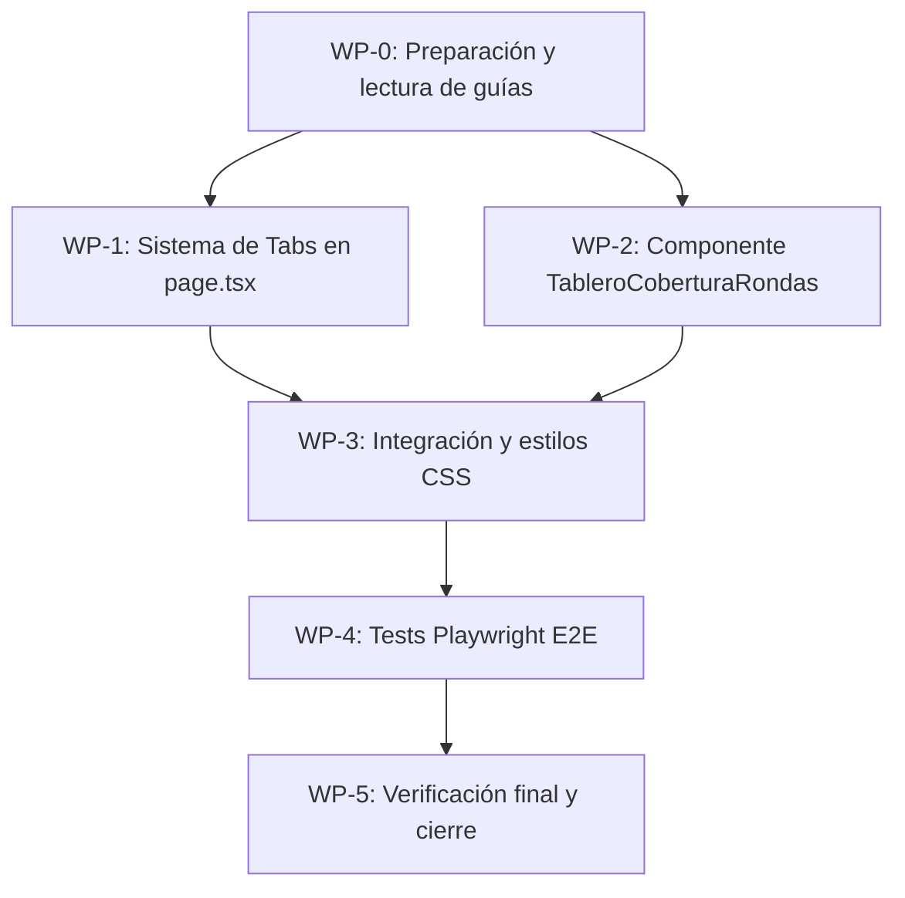

# Workflow de Implementación: Vista "Cobertura por Ronda"

**Proyecto:** calaire-app · SGC Fase 3  
**Fecha:** 2026-06-09  
**Plan fuente:** [plan_vista_cobertura_rondas.md](file:///home/w182/w421/calaire-app/grills/plan_vista_cobertura_rondas.md)

---

## Resumen ejecutivo

Implementar un tablero de cobertura documental cruzado (rondas × 12 formatos SGC) como nueva vista principal en `/dashboard/sgc`. El backend **ya está resuelto**: la query [`listRondasSgcResumen`](file:///home/w182/w421/calaire-app/convex/sgc.ts#L1406-L1430) devuelve todo lo necesario (checklist de 12 items con estado, progreso y bloqueantes por ronda). El trabajo es **100% frontend + tests**.

---

## Mapa de dependencias



---

## WP-0 · Preparación y lectura de guías

| Campo | Detalle |
|---|---|
| **Objetivo** | Asegurar que se siguen las convenciones actuales del proyecto antes de escribir código |
| **Estimación** | 10 min |
| **Riesgo** | Bajo |

### Tareas

| # | Tarea | Entregable | Criterio de aceptación |
|---|---|---|---|
| 0.1 | Leer guías Next.js del proyecto | Notas internas | Confirmar convenciones de `'use client'`, routing, imports |
| 0.2 | Leer [guidelines.md](file:///home/w182/w421/calaire-app/convex/_generated/ai/guidelines.md) de Convex | Notas internas | Confirmar que NO se necesitan cambios en Convex |
| 0.3 | Verificar que `listRondasSgcResumen` retorna campo `checklist` | N/A | Query en [sgc.ts L1406-1430](file:///home/w182/w421/calaire-app/convex/sgc.ts#L1406-L1430) ya incluye `checklist: SgcChecklistItem[]` |
| 0.4 | Revisar patrones CSS del proyecto | Notas internas | Documentar tokens: `var(--foreground)`, `var(--foreground-muted)`, `var(--surface-muted)`, `var(--border-soft)`, clase `.card` |

### Datos confirmados del backend

La query retorna por cada ronda:

```typescript
{
  _id: Id<'rondas'>,
  codigo: string,          // e.g. "R-2024-01"
  nombre: string,          // e.g. "Ronda de Plaguicidas Q1"
  estado: string,          // "activa" | "cerrada" | ...
  progreso: number,        // 0-100
  bloqueantes: string[],   // derivados del checklist
  checklist: SgcChecklistItem[]  // 12 items exactos
}
```

Cada `SgcChecklistItem` (de [checklist.ts](file:///home/w182/w421/calaire-app/lib/sgc/checklist.ts#L24-L36)):

```typescript
{
  codigo: SgcFormatoCodigo,  // "F-PPSEA-03", "F-PSEA-05", etc.
  nombre: string,
  fase: SgcFase,             // "planeacion" | "convocatoria" | "ejecucion" | "evaluacion" | "cierre"
  modo: string,
  critico: boolean,
  estado: SgcItemEstado,     // "completo" | "pendiente" | "no_aplica" | "advertencia"
  responsable: string,
  ultimaActualizacion: string | null,
  vinculo: string | null,
  observaciones: string,
  bloqueante: boolean,
}
```

---

## WP-1 · Sistema de Tabs en `page.tsx`

| Campo | Detalle |
|---|---|
| **Archivo** | [page.tsx](file:///home/w182/w421/calaire-app/app/%28protected%29/dashboard/sgc/page.tsx) |
| **Objetivo** | Convertir la sección inferior en un sistema de dos tabs |
| **Estimación** | 20 min |
| **Riesgo** | Bajo |

### Tareas

| # | Tarea | Entregable | Criterio de aceptación |
|---|---|---|---|
| 1.1 | Crear componente client `SgcTabs` wrapper | Código inline o componente | Renderiza 2 tabs: "Cobertura por Ronda" y "Documentos" |
| 1.2 | Mover la sección de Matriz Documental al tab "Documentos" | `page.tsx` modificado | La `MatrizInteractiva` se muestra solo al seleccionar tab "Documentos" |
| 1.3 | Agregar slot para `TableroCoberturaRondas` en tab default | `page.tsx` modificado | Tab "Cobertura por Ronda" activo por defecto y muestra placeholder |
| 1.4 | Mantener tarjetas de resumen de rondas arriba de los tabs | `page.tsx` sin regresiones | Las cards con progreso/bloqueantes permanecen visibles siempre |

### Diseño del cambio

**Antes** (estructura actual de [page.tsx](file:///home/w182/w421/calaire-app/app/%28protected%29/dashboard/sgc/page.tsx)):
```
┌─────────────────────────────┐
│ Header: "Resumen SGC"       │
│ Alertas success/error       │
│ Grid de tarjetas por ronda  │
│ ─── border-t ───            │
│ Matriz Documental Maestra   │
│ <MatrizInteractiva />       │
└─────────────────────────────┘
```

**Después**:
```
┌─────────────────────────────┐
│ Header: "Resumen SGC"       │
│ Alertas success/error       │
│ Grid de tarjetas por ronda  │
│ ─── border-t ───            │
│ [Cobertura por Ronda] | [Documentos]  ← Tabs
│ ┌───────────────────────────┐
│ │ <TableroCoberturaRondas/> │  ← Tab 1 (default)
│ │    — o —                  │
│ │ <MatrizInteractiva />     │  ← Tab 2
│ └───────────────────────────┘
└─────────────────────────────┘
```

### Implementación del tab system

Dado que `page.tsx` es un **Server Component** y los tabs necesitan estado client-side, se requiere un wrapper `'use client'`:

```tsx
// Dentro de page.tsx: nuevo componente client para tabs
'use client'
function SgcTabs({ children }: { children: [React.ReactNode, React.ReactNode] }) {
  const [activeTab, setActiveTab] = useState<'cobertura' | 'documentos'>('cobertura')
  // ... render tabs + children[activeTab === 'cobertura' ? 0 : 1]
}
```

> [!IMPORTANT]
> El componente de tabs debe ser **client-side** (`'use client'`), pero puede vivir como un componente separado importado desde `page.tsx` o como un wrapper inline. La `MatrizInteractiva` ya es `'use client'`, así que no hay conflicto.

### Entregable WP-1

```diff
 // page.tsx
+import TableroCoberturaRondas from './TableroCoberturaRondas'
+import SgcTabs from './SgcTabs'

 // ...dentro del JSX, reemplazar la sección inferior:
-      <section className="space-y-4 border-t border-[var(--border-soft)] pt-6">
-        <div>
-          <h2>Matriz Documental Maestra</h2>
-          ...
-        </div>
-        <MatrizInteractiva matriz={matriz} />
-      </section>
+      <section className="space-y-4 border-t border-[var(--border-soft)] pt-6">
+        <SgcTabs>
+          <TableroCoberturaRondas />
+          <div>
+            <h2>Matriz Documental Maestra</h2>
+            <MatrizInteractiva matriz={matriz} />
+          </div>
+        </SgcTabs>
+      </section>
```

---

## WP-2 · Componente `TableroCoberturaRondas.tsx`

| Campo | Detalle |
|---|---|
| **Archivo** | `app/(protected)/dashboard/sgc/TableroCoberturaRondas.tsx` **(nuevo)** |
| **Objetivo** | Tabla cruzada reactiva con dots semáforo, tooltips, scroll fijo y filtros |
| **Estimación** | 90 min |
| **Riesgo** | Medio — es el componente más complejo |

### Tareas

| # | Tarea | Entregable | Criterio de aceptación |
|---|---|---|---|
| 2.1 | Scaffold del componente `'use client'` con `useQuery` | Archivo `.tsx` | Se conecta a `api.sgc.listRondasSgcResumen` con Convex reactivo |
| 2.2 | Implementar estado local: `searchQuery`, `hideCerradas` | Estado React | Filtrado funcional por búsqueda y toggle |
| 2.3 | Indicador resumen: "X de Y rondas con cobertura completa" | UI inline | Calcula correctamente usando `progreso === 100` |
| 2.4 | Buscador de rondas | Input con icono | Filtra por `codigo` o `nombre` (case-insensitive) |
| 2.5 | Toggle "Ocultar rondas cerradas" | Checkbox | Oculta rondas con `estado === 'cerrada'` |
| 2.6 | Tabla cruzada con sticky columns | `<table>` con CSS | Columna izq fija (ronda), columna der fija (%), centro scrollable |
| 2.7 | Cabeceras agrupadas por fase | `<colgroup>` + `colspan` | 5 grupos de fase con fondo diferenciado |
| 2.8 | Celdas con dots semáforo | Dots coloreados | 4 estados visuales correctos |
| 2.9 | Tooltips al hover | Tooltip nativo o custom | Muestra `nombre` + `observaciones` del checklist item |
| 2.10 | Clic en dot navega a ronda | `router.push` | Navega a `/dashboard/rondas/[rondaId]/sgc` |
| 2.11 | Barra de progreso en columna % | Progress bar inline | Coherente con el estilo de las cards superiores |

### Subtarea 2.6: Estructura de la tabla cruzada

```
┌──────────────┬── Planeación ──┬─ Convocatoria ─┬── Ejecución ──┬─ Evaluación ─┬─ Cierre ─┬──────────┐
│ Ronda        │ F-03  │ F-06  │ F-05 │F-05A│F-07│ F-08 │ F-09 │ F-10│F-11│F-12│ F-13│F-14│ Cobertura│
├──────────────┼───────┼───────┼──────┼─────┼────┼──────┼──────┼─────┼────┼────┼─────┼────┼──────────┤
│ R-2024-01    │  🟢   │  🟢   │  🟢  │ 🟢  │ 🔴 │  🟢  │  🔴  │ 🟢  │ ⚪ │ 🟡 │  🟢 │ 🔴 │  67% ███ │
│ activa       │       │       │      │     │    │      │      │     │    │    │     │    │          │
├──────────────┼───────┼───────┼──────┼─────┼────┼──────┼──────┼─────┼────┼────┼─────┼────┼──────────┤
│ R-2024-02    │  🟢   │  🟢   │  🔴  │ 🔴  │ 🔴 │  🔴  │  🔴  │ 🔴  │ ⚪ │ 🔴 │  🔴 │ 🔴 │  17% █   │
│ activa       │       │       │      │     │    │      │      │     │    │    │     │    │          │
└──────────────┴───────┴───────┴──────┴─────┴────┴──────┴──────┴─────┴────┴────┴─────┴────┴──────────┘
  ← STICKY                    ← SCROLL HORIZONTAL →                              STICKY →
```

### Subtarea 2.7: Mapeo de formatos a fases

Basado en [catalog.ts](file:///home/w182/w421/calaire-app/lib/sgc/catalog.ts#L30-L127):

| Fase | Formatos | Columnas |
|---|---|---|
| **Planeación** | `F-PPSEA-03`, `F-PSEA-06` | 2 |
| **Convocatoria** | `F-PSEA-05`, `F-PSEA-05A`, `F-PSEA-07` | 3 |
| **Ejecución** | `F-PSEA-08`, `F-PSEA-09` | 2 |
| **Evaluación** | `F-PSEA-10`, `F-PSEA-11`, `F-PSEA-12` | 3 |
| **Cierre** | `F-PSEA-13`, `F-PSEA-14` | 2 |
| **Total** | | **12** |

### Subtarea 2.8: Mapeo de colores semáforo

| Estado (`SgcItemEstado`) | Dot | CSS Class | Significado |
|---|---|---|---|
| `completo` | 🟢 | `bg-emerald-500` | Documento completo |
| `pendiente` | 🔴 | `bg-rose-500` | Documento faltante |
| `no_aplica` | ⚪ | `bg-slate-300 dark:bg-slate-600` | No aplica a esta ronda |
| `advertencia` | 🟡 | `bg-amber-500` | Completo pero con advertencias |

### Subtarea 2.9: Lógica del tooltip

```tsx
// Cada celda muestra al hover:
<span title={`${item.nombre}\n${item.observaciones}`}>
  <span className={`dot ${dotColor}`} />
</span>
```

> [!TIP]
> Usar `title` nativo es la opción más simple y accesible. Si se desea un tooltip más rico (styled), se puede implementar con un componente custom de hover con `position: absolute`, pero el `title` nativo es suficiente para el MVP.

### Entregable WP-2

Archivo nuevo: `app/(protected)/dashboard/sgc/TableroCoberturaRondas.tsx`

**Estructura del componente:**

```tsx
'use client'

import { useState } from 'react'
import { useRouter } from 'next/navigation'
import { useQuery } from 'convex/react'
import { api } from '@/convex/_generated/api'
import { SGC_FORMATOS_FASE_1 } from '@/lib/sgc/catalog'
import { agruparChecklistPorFase } from '@/lib/sgc/checklist'

// Constantes de agrupación por fase
const FASES = [...]

export default function TableroCoberturaRondas() {
  const rondas = useQuery(api.sgc.listRondasSgcResumen)
  const router = useRouter()
  const [searchQuery, setSearchQuery] = useState('')
  const [hideCerradas, setHideCerradas] = useState(false)

  // Filtrado
  const filteredRondas = rondas?.filter(...)

  // Indicador resumen
  const completas = filteredRondas?.filter(r => r.progreso === 100).length
  
  return (
    <div>
      {/* Toolbar: búsqueda + toggle + indicador */}
      {/* Tabla cruzada con sticky columns */}
      {/* Cabeceras de fase agrupadas */}
      {/* Filas de rondas con dots */}
    </div>
  )
}
```

---

## WP-3 · Integración y estilos CSS

| Campo | Detalle |
|---|---|
| **Archivos** | `page.tsx`, `TableroCoberturaRondas.tsx`, posiblemente CSS global |
| **Objetivo** | Sticky columns, sombras de scroll, y estilos coherentes con el proyecto |
| **Estimación** | 20 min |
| **Riesgo** | Bajo |

### Tareas

| # | Tarea | Entregable | Criterio de aceptación |
|---|---|---|---|
| 3.1 | Implementar CSS para sticky left/right columns | Estilos inline o CSS module | Primera y última columna fijas durante scroll horizontal |
| 3.2 | Agregar sombras indicadoras de scroll | CSS shadows | Sombras visibles al scrollear el contenido central |
| 3.3 | Asegurar compatibilidad dark mode | Tokens CSS | Usa `var(--foreground)`, `var(--surface-muted)`, etc. |
| 3.4 | Responsive: comportamiento en mobile | Media queries | Tabla scrollable en pantallas pequeñas sin romper layout |
| 3.5 | Integrar `TableroCoberturaRondas` en tab system | `page.tsx` final | Todo conectado y renderizando |

### Estilos sticky columns

```css
/* Aplicados como estilos inline en el componente para mantener colocación */
/* Columna fija izquierda */
position: sticky;
left: 0;
z-index: 10;
background: var(--surface); /* Hereda tema claro/oscuro */

/* Columna fija derecha */
position: sticky;
right: 0;
z-index: 10;
background: var(--surface);
```

### Tokens CSS del proyecto (confirmados)

| Token | Uso |
|---|---|
| `var(--foreground)` | Texto principal |
| `var(--foreground-muted)` | Texto secundario |
| `var(--surface-muted)` | Fondo de badges |
| `var(--border-soft)` | Bordes suaves |
| `.card` | Clase para contenedores con sombra |
| `.btn-primary` | Botones principales |

### Entregable WP-3

- [page.tsx](file:///home/w182/w421/calaire-app/app/%28protected%29/dashboard/sgc/page.tsx) modificado con tabs + integración
- `TableroCoberturaRondas.tsx` con estilos finales
- Sin archivos CSS nuevos (estilos inline con tokens existentes)

---

## WP-4 · Tests Playwright E2E

| Campo | Detalle |
|---|---|
| **Archivo** | `tests/e2e/sgc-cobertura.auth.spec.ts` **(nuevo)** |
| **Objetivo** | Validar toda la funcionalidad del tablero con tests automatizados |
| **Estimación** | 30 min |
| **Riesgo** | Bajo |

> [!WARNING]
> Los tests deben correrse con `--workers=1` por límites de concurrencia local. Ver [260608_1458_problems.md](file:///home/w182/w421/calaire-app/logs/history/260608_1458_problems.md).

### Tareas

| # | Tarea | Entregable | Criterio de aceptación |
|---|---|---|---|
| 4.1 | Crear archivo de test `.auth.spec.ts` | Archivo nuevo | Sigue patrón de [sgc-fase2.auth.spec.ts](file:///home/w182/w421/calaire-app/tests/e2e/sgc-fase2.auth.spec.ts) |
| 4.2 | Test: tab "Cobertura por Ronda" activo por defecto | Assertion | Tab visible y activo al cargar `/dashboard/sgc` |
| 4.3 | Test: tabla cruzada muestra rondas | Assertion | Al menos 1 fila de ronda visible |
| 4.4 | Test: dots semáforo presentes | Assertion | Elementos con clases de color (emerald/rose/amber/slate) existen |
| 4.5 | Test: toggle "Ocultar cerradas" funciona | Assertion | Rondas cerradas desaparecen al activar toggle |
| 4.6 | Test: buscador filtra rondas | Assertion | Escribir texto filtra las filas visibles |
| 4.7 | Test: cambio a tab "Documentos" | Assertion | MatrizInteractiva se carga correctamente |

### Estructura del test

```typescript
import { expect, test } from '@playwright/test'

test.describe('SGC Cobertura por Ronda', () => {

  test('tab Cobertura por Ronda is active by default', async ({ page }) => {
    await page.goto('/dashboard/sgc')
    // Verificar tab activo
    // Verificar tabla cruzada visible
  })

  test('coverage table shows rounds with semaphore dots', async ({ page }) => {
    await page.goto('/dashboard/sgc')
    // Verificar filas de rondas
    // Verificar dots con clases de color
  })

  test('toggle hides closed rounds', async ({ page }) => {
    await page.goto('/dashboard/sgc')
    // Activar toggle
    // Verificar que rondas cerradas desaparecen
  })

  test('search filters rounds', async ({ page }) => {
    await page.goto('/dashboard/sgc')
    // Escribir en buscador
    // Verificar filtrado
  })

  test('switching to Documentos tab shows MatrizInteractiva', async ({ page }) => {
    await page.goto('/dashboard/sgc')
    // Click en tab "Documentos"
    // Verificar MatrizInteractiva
  })
})
```

### Comando de ejecución

```bash
pnpm exec playwright test tests/e2e/sgc-cobertura.auth.spec.ts --workers=1
```

### Entregable WP-4

Archivo nuevo: `tests/e2e/sgc-cobertura.auth.spec.ts`

---

## WP-5 · Verificación final y cierre

| Campo | Detalle |
|---|---|
| **Objetivo** | Validar compilación, tests, y actualizar documentación |
| **Estimación** | 15 min |
| **Riesgo** | Bajo |

### Tareas

| # | Tarea | Entregable | Criterio de aceptación |
|---|---|---|---|
| 5.1 | Verificar compilación TypeScript | `pnpm build` sin errores | Zero errors, zero warnings |
| 5.2 | Ejecutar tests Playwright completos | Test report | Todos los tests pasan con `--workers=1` |
| 5.3 | Verificación visual en navegador | Screenshot | Tabla renderiza correctamente con datos reales |
| 5.4 | Actualizar `CURRENT_SESSION.md` | Log actualizado | Marcar tareas como completadas |
| 5.5 | Crear registro de hallazgos técnicos | `logs/history/YYMMDD_HHMM_findings.md` | Documentar decisiones y patrones usados |

### Comandos de verificación

```bash
# Build
pnpm build

# Tests
pnpm exec playwright test tests/e2e/sgc-cobertura.auth.spec.ts --workers=1

# Dev server para revisión visual
pnpm dev
```

### Entregable WP-5

- Build exitoso
- Tests verdes
- Logs actualizados

---

## Resumen de entregables

| # | Entregable | Tipo | Ubicación |
|---|---|---|---|
| E-1 | `SgcTabs.tsx` | Componente client nuevo | `app/(protected)/dashboard/sgc/SgcTabs.tsx` |
| E-2 | `TableroCoberturaRondas.tsx` | Componente client nuevo | `app/(protected)/dashboard/sgc/TableroCoberturaRondas.tsx` |
| E-3 | `page.tsx` modificado | Archivo existente editado | `app/(protected)/dashboard/sgc/page.tsx` |
| E-4 | `sgc-cobertura.auth.spec.ts` | Test E2E nuevo | `tests/e2e/sgc-cobertura.auth.spec.ts` |
| E-5 | Session log actualizado | Documentación | `logs/CURRENT_SESSION.md` |
| E-6 | Registro de hallazgos | Documentación | `logs/history/YYMMDD_HHMM_findings.md` |

---

## Matriz de riesgos

| Riesgo | Probabilidad | Impacto | Mitigación |
|---|---|---|---|
| Sticky columns no funcionan en Safari | Baja | Medio | Usar `position: sticky` estándar (amplio soporte) con fallback a scroll normal |
| Query `listRondasSgcResumen` no devuelve `checklist` en tiempo real | Muy baja | Alto | Ya verificado: la query es Convex reactiva vía `useQuery` |
| Tooltip custom genera flickering | Baja | Bajo | Usar `title` nativo como primera opción; tooltip custom solo si se requiere |
| Tests Playwright fallan por auth | Media | Medio | Usar patrón `.auth.spec.ts` con `storageState` ya configurado en [playwright.config.ts](file:///home/w182/w421/calaire-app/playwright.config.ts) |
| Conflicto de z-index con sticky headers | Baja | Bajo | Usar z-index escalado: header=20, sticky-left=10, sticky-right=10 |

---

## Checklist de restricciones técnicas

- [ ] Ejecutar Playwright con `--workers=1`
- [ ] NO modificar `convex/sgc.ts` (query ya completa)
- [ ] NO modificar `lib/sgc/checklist.ts` ni `lib/sgc/catalog.ts`
- [ ] Usar `pnpm` para todo (no `npm` ni `npx`)
- [ ] Leer docs Next.js en `node_modules/next/dist/docs/` antes de tocar rutas
- [ ] Respetar tokens CSS existentes (`var(--foreground)`, `.card`, etc.)
- [ ] Componentes client deben marcar `'use client'` al inicio

---

## Orden de ejecución recomendado

```
WP-0 (10 min)  ──→  WP-2 (90 min)  ──→  WP-1 (20 min)  ──→  WP-3 (20 min)  ──→  WP-4 (30 min)  ──→  WP-5 (15 min)
 Preparar            Componente core      Tabs wrapper         Integrar todo        Tests E2E           Verificar
```

> [!TIP]
> Se recomienda empezar por **WP-2** (el componente principal) antes que WP-1 (tabs), porque el componente se puede desarrollar y testear de forma aislada. Los tabs se agregan después como wrapper.

**Tiempo total estimado: ~3 horas**
