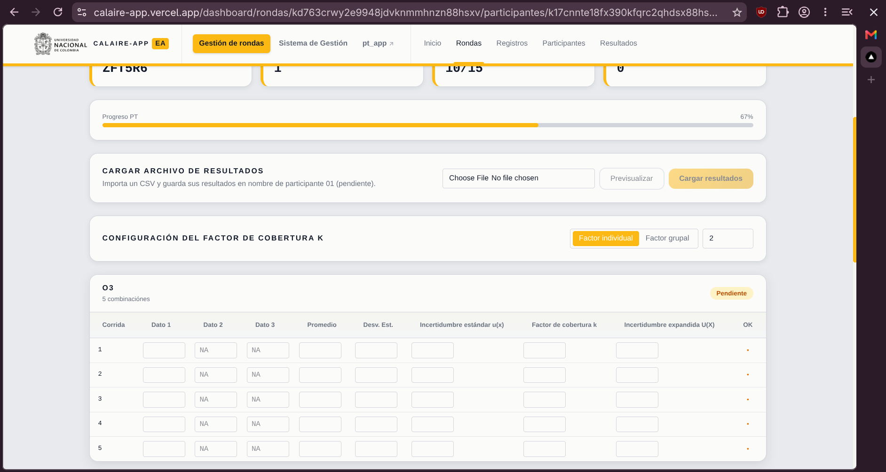

# Instrucciones para cálculo y reporte de resultados — Ronda 3

## 1. Archivos entregados

Use únicamente archivo correspondiente a cada contaminante:

- `EA-PP2026-R3_O3.csv` para ozono (`O3`);
- `EA-PP2026-R3_NO.csv` para monóxido de nitrógeno (`NO`);
- `EA-PP2026-R3_NO2.csv` para dióxido de nitrógeno (`NO2`).

Use columna `tiempo` como guía para ubicar cada registro en cronograma entregado. Así podrá identificar datos pertenecientes a cada nivel, separar periodos horarios de cálculo y excluir periodos de estabilización.

## 2. Columna de resultado

| Contaminante | Columna que debe usar |
|---|---|
| `O3` | `O3 (invitado1)` |
| `NO` | `NO (Invitado1)` |
| `NO2` | `NO2 (Invitado1)` |

Para `NO` y `NO2`, no use columnas correspondientes a otro contaminante ni columna `NOx (Invitado1)`.

## 3. Selección de datos

Para cada contaminante y nivel:

- consulte columna `tiempo` y compárela con cronograma para ubicar inicio y final de cada nivel;
- separe datos en periodos horarios de acuerdo con cronograma;
- use solamente datos comprendidos dentro del periodo asignado;
- excluya periodos de estabilización;
- no mezcle datos de niveles diferentes;
- no mezcle contaminantes;
- no modifique límites establecidos;
- no complete resultados con datos de estabilización o de otro nivel;
- no interpole ni estime valores faltantes;
- aplique criterios de validación y exclusión definidos en su procedimiento interno;
- conserve trazabilidad de datos usados y excluidos.

### Criterio mínimo de datos válidos

Datos tienen frecuencia de un registro por minuto. Para calcular promedio de un periodo horario debe contar con mínimo **75 % de datos válidos**, equivalente a **45 datos válidos de 60 esperados**.

- calcule promedio horario solamente cuando cumpla este criterio;
- calcule desviación estándar horaria usando mismos datos minutales válidos incluidos en promedio;
- excluya registros no válidos antes de verificar cumplimiento del 75 %;
- no complete cantidad mínima mediante interpolación, estimación, ceros ni datos externos al periodo horario;
- si periodo no alcanza 75 %, no calcule promedio horario y documente situación.

## 4. Datos no numéricos, faltantes y negativos

Registros como `Samp<`, celdas vacías u otros contenidos no numéricos no deben convertirse en cero.

Trátelos según su procedimiento interno. Cuando no sean resultados válidos, exclúyalos y documente tratamiento aplicado. No los reemplace mediante interpolación o estimación.

Valores negativos numéricos siguen siendo resultados numéricos. No deben eliminarse solamente por ser negativos. Cualquier exclusión debe tener sustento técnico y documental.

## 5. Nivel inicial o nivel cero

Para este ejercicio, **nivel 1 corresponde al nivel inicial o nivel cero**.

Para nivel 1:

- identifique periodo horario correspondiente mediante columna `tiempo` y cronograma;
- verifique que hora contenga mínimo 45 datos minutales válidos;
- calcule promedio de datos minutales válidos y regístrelo en `Dato 1`;
- calcule desviación estándar con mismos datos minutales válidos usados para obtener `Dato 1`;
- deje `Dato 2` y `Dato 3` sin diligenciar;
- registre en `Promedio` mismo valor reportado en `Dato 1`;
- registre incertidumbre estándar, factor de cobertura e incertidumbre expandida según corresponda.

## 6. Demás niveles

Para cada nivel diferente del nivel inicial calcule y reporte tres promedios horarios:

- promedio de primera hora en `Dato 1`;
- promedio de segunda hora en `Dato 2`;
- promedio de tercera hora en `Dato 3`.

Cada promedio horario debe:

- corresponder al periodo identificado mediante columna `tiempo` y cronograma;
- usar solamente datos minutales válidos del nivel;
- contar con mínimo 45 datos válidos de 60 esperados;
- excluir periodos de estabilización;
- conservar soporte y trazabilidad de datos empleados.

Después de obtener tres promedios horarios:

- reporte promedio de `Dato 1`, `Dato 2` y `Dato 3` en campo `Promedio`;
- calcule y reporte en `Desv. Est.` desviación estándar de esos tres promedios horarios.

Si periodo horario no cumple criterio de 75 %, no calcule promedio correspondiente y deje campo sin diligenciar. No complete campos faltantes con ceros, datos estimados, datos de otro nivel o datos de estabilización.

## 7. Campos que debe diligenciar

Vista de tabla para reporte:

Para cada corrida diligencie:

### Dato 1, Dato 2 y Dato 3

Resultados obtenidos para nivel evaluado.

- nivel inicial: solamente `Dato 1`;
- demás niveles: `Dato 1`, `Dato 2` y `Dato 3`;
- campos que no correspondan deben quedar vacíos;
- no escriba `NA`, texto ni unidades dentro de campos numéricos.

### Promedio

- nivel inicial: reporte mismo promedio horario registrado en `Dato 1`;
- demás niveles: reporte promedio de tres promedios horarios registrados en `Dato 1`, `Dato 2` y `Dato 3`.

### Desv. Est.

- nivel inicial: reporte desviación estándar calculada con datos minutales válidos usados para obtener `Dato 1`;
- demás niveles: reporte desviación estándar de tres promedios horarios registrados en `Dato 1`, `Dato 2` y `Dato 3`.

### Incertidumbre estándar u(x)

Reporte incertidumbre estándar asociada al resultado. Valor debe ser mayor o igual a cero.

### Factor de cobertura k

Reporte factor de cobertura usado según procedimiento interno. Valor debe ser mayor o igual a cero.

Puede seleccionar factor individual para diligenciar valor por corrida o factor grupal para aplicar mismo valor a todas.

### Incertidumbre expandida U(X)

Reporte incertidumbre expandida asociada al resultado. Valor debe ser mayor o igual a cero.

## 8. Incertidumbre de medición

Estime incertidumbre según procedimiento interno vigente.

Mantenga disponibles:

- fuentes de incertidumbre consideradas;
- método de evaluación;
- presupuesto de incertidumbre;
- factor de cobertura aplicado;
- cálculos;
- registros de soporte.

No se exige reemplazar modelo interno por modelo común para ronda. Resultado debe ser técnicamente sustentable y trazable.

## 9. Unidades y expresión de resultados

- Reporte `O3`, `NO` y `NO2` en `nmol/mol`, salvo instrucción oficial diferente.
- Use misma unidad para resultados, promedio, desviación estándar e incertidumbres.
- No escriba unidad dentro de campos numéricos.
- Use punto como separador decimal.
- Aplique criterios de redondeo definidos en su procedimiento interno.
- Mantenga coherencia entre cifras decimales del resultado y su incertidumbre.
- Documente correcciones, conversiones o factores aplicados.
- No cambie resultados negativos a cero sin sustento técnico.

## 10. Guardado y envío

- Complete cada fila correspondiente a contaminante y corrida.
- Verifique indicador `OK` de cada fila.
- Corrija filas marcadas con error antes de continuar.
- Confirme que progreso esté completo.
- Revise todos los valores antes de seleccionar `Enviar informe final PT`.
- Después del envío final, verifique mensaje de confirmación.

## 11. Verificación final

- [ ] Se usó columna correcta para cada contaminante.
- [ ] Se consultó columna `tiempo` para ubicar cada periodo según cronograma.
- [ ] Se excluyeron periodos de estabilización.
- [ ] No se mezclaron niveles ni contaminantes.
- [ ] Datos no numéricos no se convirtieron en cero.
- [ ] Cada promedio horario se calculó con mínimo 45 datos válidos de 60 esperados.
- [ ] Nivel inicial contiene solamente `Dato 1` y desviación calculada con datos minutales válidos.
- [ ] Demás niveles contienen hasta tres promedios horarios válidos.
- [ ] Desviación estándar de demás niveles se calculó con tres promedios horarios.
- [ ] Campos no aplicables quedaron vacíos.
- [ ] Promedio y desviación estándar corresponden a resultados reportados.
- [ ] Incertidumbre estándar, factor de cobertura e incertidumbre expandida están diligenciados.
- [ ] Todos valores numéricos usan punto decimal y no incluyen unidades.
- [ ] Todas filas muestran estado correcto.
- [ ] Cálculos, exclusiones e incertidumbre conservan soporte técnico.
